# E-Commerce Customer Retention

Dataset source: Kaggle
https://www.kaggle.com/datasets/ankitverma2010/ecommerce-customer-churn-analysis-and-prediction/data

## Problem Statement
In e-commerce, the cost of customer acquisition is usually higher than the cost of retention. A high churn rate acts like a situation where marketing efforts are wasted as customers leave the platform. Identifying at-risk customers before they leave the platform is critical for maintaining a profitable dan sustainable business

## Objective
To analyze key behavioral patterns that drive customer attrition and build a predictive model that allows the business to prepare data-driven retention strategies.

## Insights from EDA
### Churn Ratio
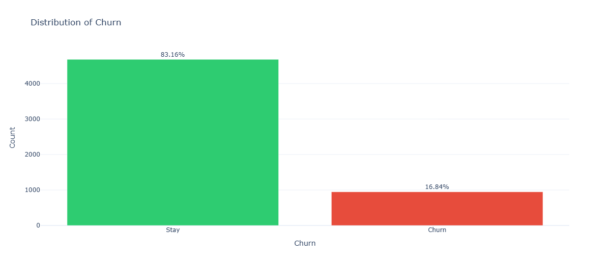

The dataset reveals that 83.16% of the users are loyal customers, while the remaining 16.84% have churned from the platform.

### Impact of Warehouse Distance on Customer Churn
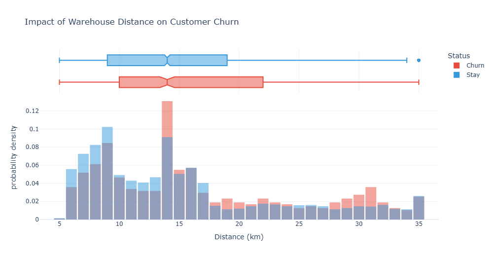

From the visualization, loyal customers are most dense at 9 km radius and the peak of churned customers are at 14 km. Although both groups share the same median at 14 km, there is a divergence at Q3 where 75% of staying customers reside within 19 km, compared to 22 km for thos who churn. This suggest that 19-22 km range can be a threshold where distance likely drives attrition and confirming that customers living beyond 19 km have a higher probability to leave the platform.

### Impact of Complains on Churn Rate
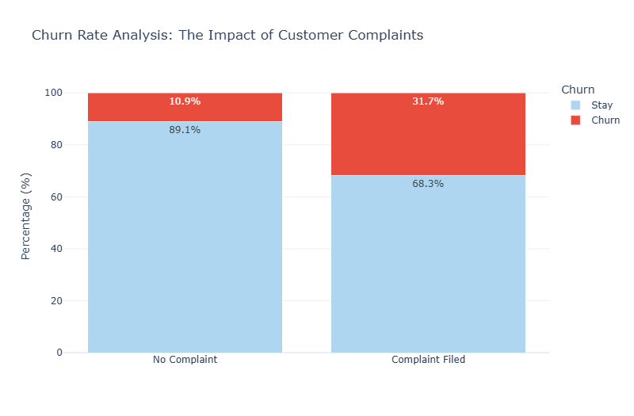

The result reveals a contrast between customer complaints and the decision to churn. Customers who complained exhibit a churn rate 31.7%, which is nearly triple the rate of customer that never complained 10.9%. This silent churn remains a significant threat that may undetected.

### Cashback and Loyalty
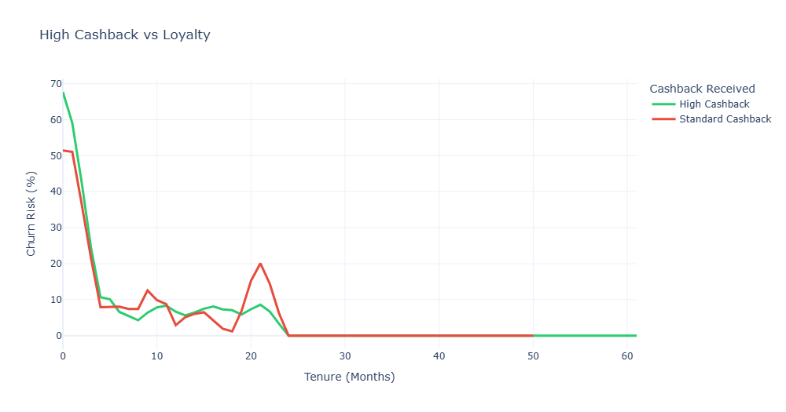

The result above reveals that high cashback segment shows a significantly higher initial churn risk (67.7%) in the first month compared to standard cashback group (51.5%). This confirms the financial rewards primarily attract promo hunters where they use the big cashback during initial usage and exit immediately. Once the customer survive the first 6 months, the impact of cashback amount diminishes as the primary driver shift to organic. The most significant milestone occurs at the 24 month where churn risk for both groups hits 0% which might indicate absolute retention This users who remain past the 2 years transform into a permanent user and tenure effectively eliminates the risk of churn.

### Feature Correlation
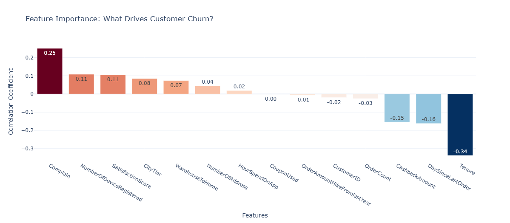

The feature correlation provides a view of which drivers behind customer churn. From the result, Tenure is the strongest individual predictor with a negative correlation of -0.34, which confirms that the longer a customer stays, the less likely they are to churn. On the other hand, Complain exhibits the strongest positive correlation with churn at 0.25 which confirms it as a primary red flag for immediate customer exit. Other negative correlations like DaySinceLastOrder (-0.16) and CashbackAmount (-0.15) suggests that recent engagement and financial incentives play a meaninfgul roles in retention also.

### Churn Risk Accross Login Devices
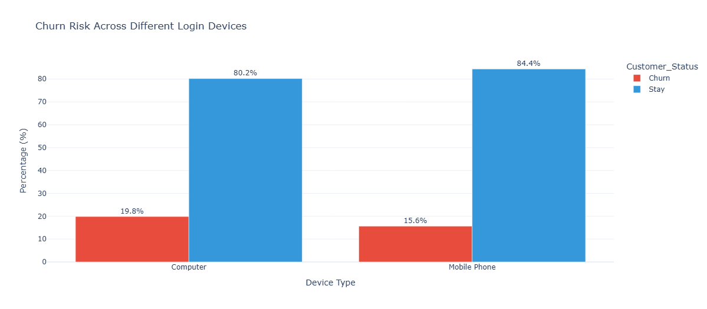

The comparison of churn rates by login device shows that customers who using a computer exhibit a higher churn rate of 19.8% compared to mobile phone users at 15.6%. This suggests mobile users are slightly more loyal and the desktop experience might be not as easier rather than mboile which lead to higher churn on computer users.

### Coupon Depedency
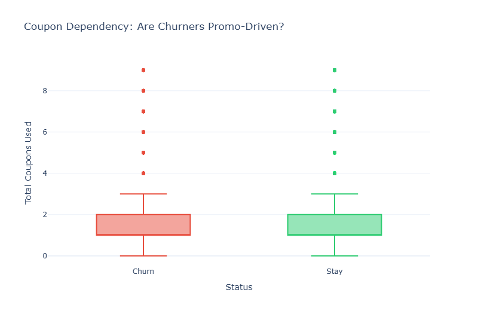

The result shows a similar pattern between churned and stayed customers where it has the same median usage and interquartile. This indicates that the total quantity of coupons used is not a standalone predictor of churn, but more likely in how dependent a customer becomes on these incentives to maintain activity.

### Satisfaction and Churn Risk
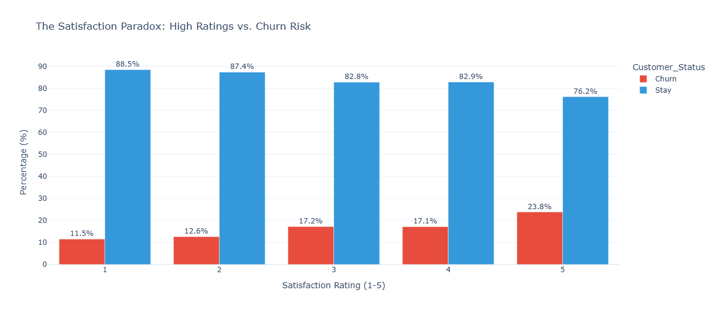
The churn probability here shows something that unusual where higher satisfaction lead to a higher likelihood of churn. While customers with a score of 1 or 2 shows a relatively low churn probability, those who give higher rating exhibit higher risk of attrition. It means that a high score cannot be an indicator of loyalty alone.

### Product Category and Churn Rate
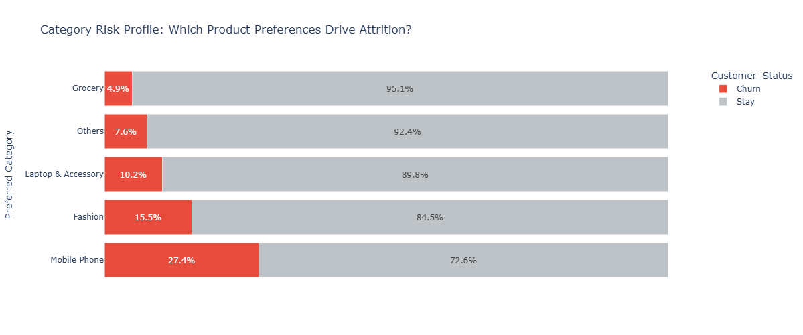

Across several product categories, mobile phone segment shows the highest attrition rate at 27.4%, higher that onther category. The grocery here shows the most stable one with churn rate only 4.9%. This indicates that while the platform successfuly build loyalt that based on habit through daily need items, it still struggle to retain buyers from tech sectors which more price sensitive and prone to switching platform for better deals. This means a need for category focused retention strategies to secure the customer loyaty.

## Modeling
For the model selection, XGBoost - KNN - Logistic Regression were compared.

### Model Perfomance Comparison
| Model | Accuracy | Recall (Churn) | F1-Score |
| :--- | :---: | :---: | :---: |
| Logistic Regression | 0.7948 | 0.8211 | 0.5746 |
| XGBoost | 0.9520 | 0.8368 | 0.8548 |
| KNN | 0.9121 | 0.9737 | 0.7889 |

Based on the initial evaluation, XGBoost was selected as the primary base model as it delivered to most optimal balance. This model achieved the highest accuracy 0.952 and F1-score 0.854. While KNN here yielded a higher recall score, its overall precision still lacking.

From this case, XGBoost is pretty effecitve at mapping non-linear relationship. This allowed the model to accurately interpret complex patterns discovered during EDA. Also, XGBoost is good at evaluating how multiple variables interact simultaneously.

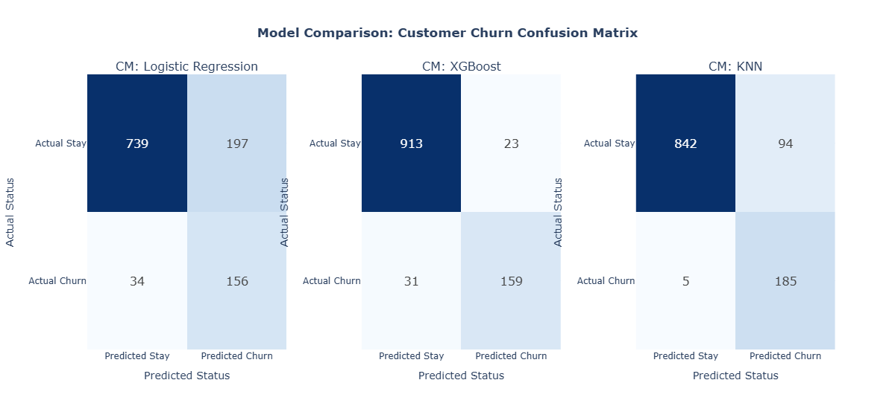

The confusion matrices reveals the business implications of each algorithm's predictions. From a cost-efficiency perspective, the baseline XGBoost offered the best operational balance, generating only 23 False Positives (FP). This minimizes the risk of the business wasting marketing budget on users who are already loyal.

KNN cast the widest net, achieving the highest sensitivity by correctly identifying 185 churners (TP) and missing only 5. However, this came at the steep cost of 94 FPs, which would lead to inflated operational costs in retention campaigns

Logistic Regression performed worst here, struggling with both high FN (34) and a massive 197 FP proving its inability to handle the dataset's non-linear complexity

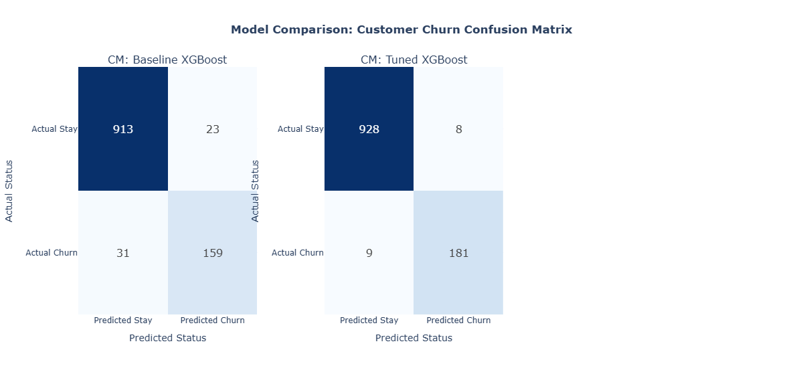

### Feature Importance
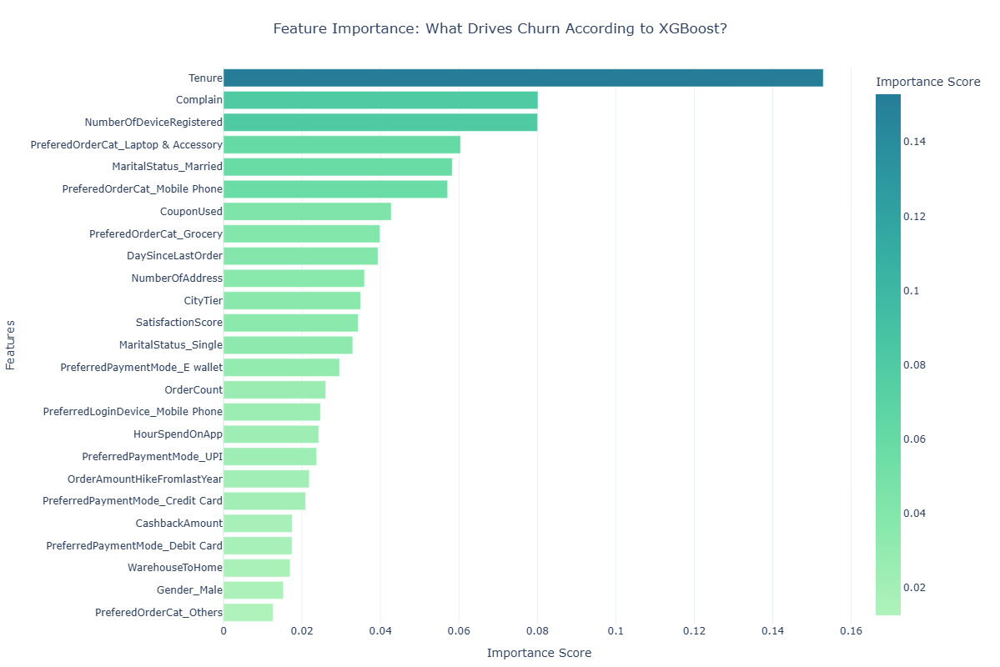
From the optimized XGBoost model, the result above show the feature importance scores.

- Tenure is the most influential predictor of churn, it means that the longer a customer stays with the paltform, the more resilitent they become to attrition.
- Complain ranks as the second strongest predictor, serving as an immediate red flag and a direct trigger for churn if not handled properly by customer service.
- NumberOfDeviceRegistered and specific tech categories ('Laptop & Accessory' and 'Mobile Phone') rank highly. This suggests a high-risk segment of price-sensitive customers who register multiple devices to exploit one-off discounts for expensive electronics, only to churn immediately after

### Business Impact Simulation
### **Business Simulation Assumptions**

To quantify the financial impact of the model, the following business assumptions were applied to the test set:
- Promotion Cost (Rp 50,000)
- Customer Lifetime Value / CLV (Rp 300,000)
- Retention Success Rate (50%)
- Model performance data based on the Tuned XGBoost Confusion Matrix results:
    * True Positive (TP): 181 (Correctly identified churners)
    * False Positive (FP): 8 (Loyal customers misidentified as churners)
    * False Negative (FN): 9 (Churners missed by the model)
    * True Negative (TN): 928 (Correctly identified loyal customers)
 
| Strategy | Targeted Audience | Total Cost (Rp) | Net Profit (Rp) |
| :--- | :---: | :---: | :---: |
| Without Model | 1,126 | 56,300,000 | -27,800,000 |
| With Tuned XGBoost | 189 | 9,450,000 | 17,700,000 |

By utilizing the model, the company can reduce the target audience from 1,126 to 189 customers, cutting marketing expenses by 83%. The strategy also shifts the campaign from a Rp 27.8M loss (due to inefficient spending) to a Rp 17.7M net profit. The model ensures that retention budgets are allocated only to high-risk customers, maximizing the return on every money spent.

## Note
Despite its high performance, the model identifies churn correlations without addressing root-cause causality (such as operational issues), and may be influenced by response bias in satisfaction surveys. Additionally, its reliance on internal data means it lacks visibility into external market factors like competitor pricing, while the use of synthetic data (SMOTE) requires continuous validation against real-world volatility to prevent over-generalized predictions.
